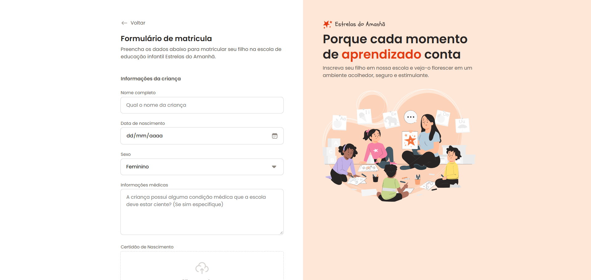

# 📝 Estrelas do Amanhã - Formulário de Matrícula

Formulário de matrícula escolar da escola fictícia de educação infantil **Estrelas do Amanhã**. A página contém um formulário completo com campos para informações da criança, endereço, responsável e opções de matrícula (turno e esporte), além de uma seção lateral com a identidade visual e proposta da escola.

## 📸 Preview

 

## 🚀 Demonstração

🔗 [Acessar o site](https://rochacode08.github.io/form-matricula/)

## 🛠️ Tecnologias utilizadas

- **HTML5** — estruturação semântica com `<form>`, `<fieldset>`, `<legend>`, `<label>`
- **CSS3** — estilização com Flexbox, Grid, variáveis CSS e CSS Nesting
- **Google Fonts** — tipografia com a fonte *Poppins*

## ✨ Funcionalidades

- ✅ Formulário dividido em 4 seções (criança, endereço, responsável, opções)
- ✅ Campos de **texto, data, select, textarea e telefone**
- ✅ Área de **upload de arquivo** (dropzone) customizada
- ✅ **Validação nativa** de email com mensagem de erro visual
- ✅ **Campos desabilitados** com estilo diferenciado (rua, cidade, estado)
- ✅ Grupo de **radio buttons customizados** com ícones (turno e esportes)
- ✅ **Checkbox customizado** para aceite de termos
- ✅ Botões primário e secundário com estados de hover e focus
- ✅ Layout em **2 colunas** (formulário + aside) em desktop
- ✅ **Responsividade** para tablets e celulares
- ✅ Arquitetura CSS **modular** com arquivos separados por componente

## 🎨 Paleta de cores

Paleta com laranja como cor principal, transmitindo acolhimento e energia:

| Cor                    | Hex       |
| ---------------------- | --------- |
| 🟠 Text Highlight      | `#E43A12` |
| 🔶 Stroke Highlight    | `#F3541C` |
| 🟧 Surface Secondary   | `#FEE7D6` |
| ⚫ Text Primary         | `#292524` |
| 🔘 Text Secondary      | `#57534E` |
| 🔹 Text Tertiary       | `#8F8881` |
| 🔲 Stroke Default      | `#D6D3D1` |
| ⬜ Surface Disabled     | `#E7E5E4` |
| 🔴 Semantic Error      | `#DC2626` |

## 📂 Estrutura do projeto

```
📦 estrelas-do-amanha
 ┣ 📂 assets
 ┃ ┣ 📂 icons              → Ícones SVG (inputs, radios, checkboxes, esportes)
 ┃ ┣ 🖼️ logo.svg
 ┃ ┗ 🖼️ Illustration.svg
 ┣ 📂 style
 ┃ ┣ 📂 fields             → Componentes de formulário
 ┃ ┃ ┣ 📜 index.css        → Importa todos os componentes de form
 ┃ ┃ ┣ 📜 input.css        → Estilos de input, textarea e select
 ┃ ┃ ┣ 📜 droparea.css     → Área de upload de arquivo
 ┃ ┃ ┣ 📜 radio.css        → Radio buttons customizados
 ┃ ┃ ┣ 📜 checkbox.css     → Checkbox customizado
 ┃ ┃ ┗ 📜 buttons.css      → Botões primário e secundário
 ┃ ┣ 📜 index.css          → Arquivo principal (importa os demais)
 ┃ ┣ 📜 global.css         → Reset, variáveis e estilos globais
 ┃ ┣ 📜 layout.css         → Estrutura de layout (grid de 2 colunas)
 ┃ ┗ 📜 form.css           → Estilos base do formulário
 ┗ 📜 index.html            → Página principal
```

## 📱 Responsividade

O projeto conta com 2 breakpoints principais:

| Dispositivo    | Largura          | Principais ajustes                                    |
| -------------- | ---------------- | ----------------------------------------------------- |
| 💻 Desktop     | acima de 768px   | Layout de 2 colunas (form + aside)                    |
| 📱 Tablet      | 426px - 768px    | Aside vira topo, form ocupa toda a largura            |
| 📱 Mobile      | até 425px        | Radio buttons em grid 2x2, botões empilhados          |

## 💻 Como rodar o projeto

Clone o repositório:

```bash
git clone https://github.com/rochacode08/form-matricula.git
```

Acesse a pasta do projeto:

```bash
cd form-matricula
```

Abra o arquivo `index.html` no navegador — ou utilize a extensão **Live Server** do VS Code para recarregamento automático.

## 📚 O que foi trabalhado

Durante o desenvolvimento, foram aplicados os seguintes conceitos:

- Estruturação semântica de formulários com `<fieldset>` e `<legend>`
- Uso de `<label>` vinculado a inputs via atributo `for`
- **Customização de inputs nativos** mantendo acessibilidade (`appearance: none`)
- Criação de **radio buttons customizados** com imagens e ícones
- Criação de **checkbox customizado** usando pseudo-classe `:has()`
- Área de **upload de arquivo** (dropzone) com input invisível sobreposto
- Validação nativa com `required` e estilização de `:invalid`
- Exibição condicional de mensagens de erro com `:not(:focus):valid`
- Uso de `grid-template-columns: repeat(auto-fit, minmax())` para grids responsivos
- **CSS Nesting** nativo em todos os arquivos
- Customização do ícone de calendário em `input[type="date"]`
- Customização da seta do `<select>` via `background-image`
- Uso extensivo de **CSS Custom Properties** (variáveis)
- Arquitetura CSS modular com `@import`
- Uso da sintaxe moderna de range queries em media queries

## 🔮 Melhorias futuras

- [ ] Implementar validação completa de todos os campos com JavaScript
- [ ] Integrar a busca de CEP com a API ViaCEP para preenchimento automático
- [ ] Adicionar máscara aos campos de telefone e CEP
- [ ] Implementar o upload real do arquivo (com preview)
- [ ] Adicionar feedback visual ao enviar o formulário (loading e sucesso)
- [ ] Salvar progresso no localStorage ao clicar em "Salvar respostas"
- [ ] Melhorar acessibilidade com mensagens de erro vinculadas via `aria-describedby`

## 📝 Licença

Este projeto foi desenvolvido apenas para fins **educacionais e de estudo**.

---

## 👨‍💻 Autor
Desenvolvido com 💙 por **[Gabriel Rocha Lopes](https://github.com/rochacode08)**

<a href="mailto:gabrielrocha.devstack@gmail.com">
    
</a>
<a href="https://www.linkedin.com/in/gabriel-rocha-devstack">
    
</a>
<a href="https://www.instagram.com/gabriel_lopess15/">
    
</a>

---